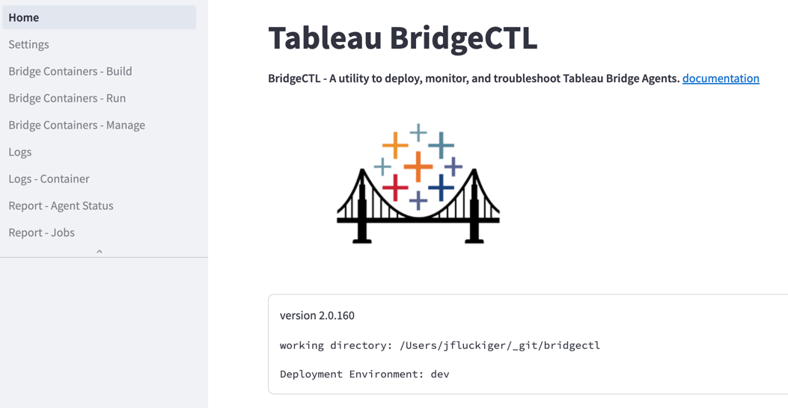
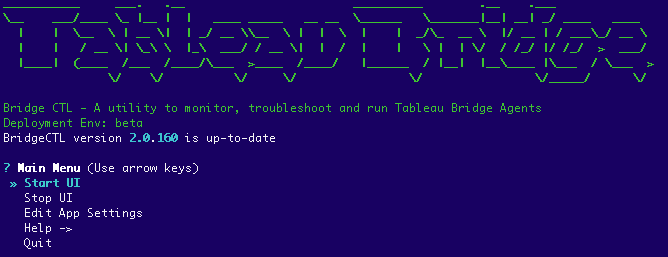

# Tableau BridgeCTL
BridgeCTL is a utility to run, monitor, and troubleshoot Tableau Bridge agents. BridgeCTL runs on Linux, Windows and Mac.

### Setup
BridgeCTL is easy to install. Just download and run the bridgectl_setup.py script using the following commands:
```
curl -L https://github.com/tableau/bridgectl/releases/download/setup/bridgectl_setup.py --output bridgectl_setup.py
python bridgectl_setup.py
```
Note python 3.10 or greater is required. Please use the appropriate command to run the setup script, for example instead of "python" you may need to use "python3" or "python3.11". 
BridgeCTL The setup script will create a folder "bridgectl" and unzip the utility into this folder. 

### Requirements
- Python >= 3.10
- For running Bridge on Linux containers: Docker Desktop

#### Automatic updates
Each time BridgeCTL starts, it will check for updates and give the option to download and apply the latest updates.

### Features
- Build a bridge docker container 
  - This includes downloading the latest bridge rpm from tableau.com, user can specify to get latest or a specific version they want to use.
  - Download and install database drivers, we use the container_image_builder utility to allow the user to select a set of database drivers from a dropdown list.
- Run bridge containers
  - user can easily select configuration settings from Tableau Cloud 
  - user can easily spin up multiple local bridge-linux containers
- Analyze bridge logs
  - log viewer with ability to filter and sort logs
  - Summarize logs using a GPT API, which makes it easier to identify and fix errors, and get an overall indication of the health and load of the bridge agent.
- Manage bridge containers
  - View configuration settings and resource utilization for local bridge containers
  - Remove a bridge container
  - Show summary metrics about the Bridge logs.
- Reports
  - Display Jobs Report similar to the jobs report in Tableau Cloud
  - Display Bridge agent status similar to the bridge settings page in Tableau Cloud

### Documentation for Tableau Bridge
See official Tableau documentation for creating bridge containers on Linux
https://help.tableau.com/current/online/en-us/to_bridge_linux_install.htm

### Example scripts
For example bash scripts for creating Bridge on Docker see the sub folder: /example_build_docker_basic

### Terms of Use
This repo contains utilities, source code example files for creating Tableau bridge Linux containers.
These scripts may be useful but are unsupported. Please get help from other users on the Tableau Community Forums.

<br><br><br>
### User interface screenshots
Home


Analyze Logs


Command-line Interface


